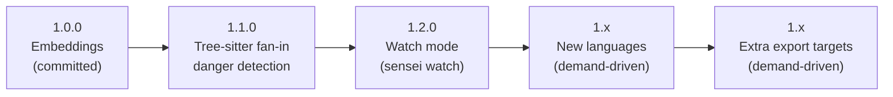

# Sensei — Project Roadmap

**Date:** 2026-06-20
**Status:** Living document — current state is fact; everything past §3 is a proposal, not a commitment.
**Current version:** `0.9.0`
**Thesis (unchanged, non-negotiable):** local-first, deterministic, no API key, no network, no LLM in the loop. Same repo + same task = same answer. Every roadmap item is judged against this; anything that breaks it is out.

---

## 1. Where we are (shipped)

| Version | Capability |
|---------|-----------|
| `0.1.0` | `init` · `scan` · `context` · `export --target claude` |
| `0.2.0` | `validate-diff` · `guard` (git hook, managed block) |
| `0.3.0` | live `scan` TUI · single-pass git history · raw-`typescript` AST extraction |
| `0.4.0` | `validate-plan` (pre-code reuse/danger check) · `dangerous.paths` globs |
| `0.5.0` | shell autocomplete (zsh/bash/powershell) |
| `0.6.0` | GitHub Action (gate PRs in CI) |
| `0.7.0` | multi-language via Tree-sitter — Python, Go, Rust, Java |
| `0.8.0` | `export --target cursor\|codex` · `--write` managed-section injection |
| `0.9.0` | `sensei mcp` — stdio MCP server (`find_reuse`, `scan`) |

**The two "final planned items" from the [2026-06-18 design](2026-06-18-exporters-and-embeddings-design.md) are now split:**
- ✅ Cursor/Codex exporters — **shipped in 0.8.0**.
- ⏳ Embeddings-based semantic retrieval — **designed and approved, not yet built**. This is the one remaining committed item.

> **Stale doc to fix:** `README.md` "Roadmap" still lists Cursor/Codex exporters as *planned*. Correct it when the next release lands (exporters shipped; embeddings is the only outstanding planned item).

---

## 2. Known gaps (debt, not features)

These are honest holes in current capability. Closing them is higher-leverage than most new features because they remove asterisks from things we already advertise.

1. **High-fan-in "dangerous" detection is TS/JS-only.** Python/Go/Rust/Java rely on `dangerous.paths` globs because there is no import graph for them. The product promise ("which files are load-bearing") is half-delivered for 4 of 6 languages.
2. **Embeddings unshipped.** `context` is lexical-only (FTS5). Query "login" misses `authenticate`. Design exists; no code.
3. **No watch / incremental daemon.** Every `scan` is invoked cold. Fine for CI, friction for live editor loops.

---

## 3. Committed next milestone → `1.0.0`

**Embeddings-based retrieval**, exactly as specified in [2026-06-18-exporters-and-embeddings-design.md §4](2026-06-18-exporters-and-embeddings-design.md). No scope change.

- Local ONNX (`@xenova/transformers`, `all-MiniLM-L6-v2`, 384-dim), cached under `.sensei/models/`.
- Brute-force cosine over BLOB vectors in SQLite. No ANN, no API provider. Upgrade path documented in code (`ponytail:` comment).
- Union FTS ∪ vector top-K → one added weighted scorer term. Determinism, reasons, and all existing signals preserved.
- Graceful degradation: model unavailable → lexical-only with one warning, no crash.

**Why this is the 1.0 line:** it completes the originally-scoped feature set. After it ships, the CLI surface and config schema stabilize and the project can commit to backward compatibility (the pre-1.0 caveat in the README goes away).

Needs its own implementation plan (writing-plans skill) before code.

---

## 4. Candidate directions beyond 1.0 (proposals)

Grouped by theme. Each is scored on **leverage** (impact on the core thesis) and **cost** (rough effort). None is committed; this section exists to make the *next* prioritization conversation cheap.

### Theme A — Retrieval quality
| Item | Leverage | Cost | Notes |
|------|----------|------|-------|
| Scorer weight auto-tuning / presets | med | low | Ship sane presets per repo type; no telemetry, stays deterministic. |
| ANN index (`sqlite-vec`) | low (now) | med | Only when corpus > ~50k symbols proves brute-force slow. Upgrade path already in code. Defer until measured. |
| Richer "why" reasons in reports | med | low | Agents act better on explained signals. Pure presentation, no new deps. |

### Theme B — Language coverage
| Item | Leverage | Cost | Notes |
|------|----------|------|-------|
| **Fan-in danger detection for Tree-sitter langs** | **high** | med-high | Closes gap #1. Needs a per-language import/dependency extractor feeding the existing fan-in analysis. Biggest single credibility win. |
| More languages (C#, Ruby, PHP, Kotlin, C/C++) | med | low each | `LangSpec` + vendored `.wasm` framework makes each new language a query file + tests. Cheap, additive, demand-driven. |

### Theme C — Integration surface
| Item | Leverage | Cost | Notes |
|------|----------|------|-------|
| Watch mode (`sensei watch`) | high | med | Incremental re-scan on file change → keeps `.sensei/` and MCP context warm during a coding session. Removes gap #3. |
| More export targets (Windsurf, Cline, Continue, Aider) | med | low each | Design deliberately stopped at cursor/codex; revisit per real user demand. Same renderer pattern. |
| VS Code / editor extension | med | high | Surfaces reuse/danger inline. Large surface; only if adoption justifies it. |

### Theme D — Scale / structure
| Item | Leverage | Cost | Notes |
|------|----------|------|-------|
| Monorepo / workspace awareness | med | med | Per-package indexes or scoped queries for large repos. |
| Cross-repo / org index | low | high | Off-thesis (local-first); likely never. Listed to explicitly park it. |

---

## 5. Recommended sequence

Closing gaps before adding surface area. Suggested order after 1.0:

Rationale: **1.0** finishes the planned set. **1.1** removes the most visible asterisk (danger detection now means the same thing in every language). **1.2** makes Sensei a live companion, not a batch tool. Everything after is additive and pulled by real demand rather than pushed on a schedule.

---

## 6. Non-goals (durable)

Reaffirmed so the roadmap can't drift into them:

- **No remote/API embedding provider.** Kills offline CI and adoption.
- **No LLM in the scoring loop.** Determinism is the product.
- **No telemetry / phone-home.** Local-first means local-only.
- **No re-ranking / cross-encoder model.** Cosine is the only semantic signal.
- **No cross-repo cloud index** unless the thesis itself is revisited.

---

## 7. Open questions for the next planning pass

1. Does the Tree-sitter fan-in extractor reuse the TS import-graph data model, or need a per-language abstraction? (Determines 1.1 effort.)
2. Watch mode: standalone command, or fold into the MCP server's incremental scan? (MCP already scans on `find_reuse`.)
3. Which languages have actual user pull before we spend the (cheap) per-language cost?
4. Do we commit to backward compat at 1.0, or hold for 1.1 once fan-in lands?
