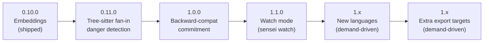

# Sensei — Project Roadmap

**Date:** 2026-06-20 (last revised 2026-06-26)
**Status:** Living document — current state is fact; everything past §3 is a proposal, not a commitment.
**Current version:** `0.10.0`
**Thesis (unchanged, non-negotiable):** local-first, deterministic, no API key, no network, no LLM in the loop. Same repo + same task = same answer. Every roadmap item is judged against this; anything that breaks it is out.

---

## 1. Where we are (shipped)

| Version | Capability |
|---------|-----------|
| `0.1.0` | `init` · `scan` · `context` · `export --target claude` |
| `0.2.0` | `validate-diff` · `guard` (git hook, managed block) |
| `0.3.0` | live `scan` TUI · single-pass git history · raw-`typescript` AST extraction |
| `0.4.0` | `validate-plan` (pre-code reuse/danger check) · `dangerous.paths` globs |
| `0.5.0` | shell autocomplete (zsh/bash/powershell) |
| `0.6.0` | GitHub Action (gate PRs in CI) |
| `0.7.0` | multi-language via Tree-sitter — Python, Go, Rust, Java |
| `0.8.0` | `export --target cursor\|codex` · `--write` managed-section injection |
| `0.9.0` | `sensei mcp` — stdio MCP server (`find_reuse`, `scan`) |
| `0.10.0` | embeddings-based semantic retrieval (local offline `all-MiniLM-L6-v2`, fused into reuse ranking) |

**The two items from the [2026-06-18 design](2026-06-18-exporters-and-embeddings-design.md) are now both shipped:** Cursor/Codex exporters in `0.8.0`, embeddings in `0.10.0`. The originally-scoped feature set is complete.

> **README sync:** the README's Roadmap section already points here as the single source of truth (shipped capabilities + a link, no duplicated roadmap). The `Versioning` section carries the per-release list and the pre-`1.0.0` caveat. No README drift to fix.

---

## 2. Known gaps (debt, not features)

These are honest holes in current capability. Closing them is higher-leverage than most new features because they remove asterisks from things we already advertise.

1. **High-fan-in "dangerous" detection is TS/JS-only.** Python/Go/Rust/Java rely on `dangerous.paths` globs because there is no import graph for them. The product promise ("which files are load-bearing") is half-delivered for 4 of 6 languages. **→ Closed by `0.11.0` (§3).**
2. ~~Embeddings unshipped.~~ **Closed by `0.10.0`.**
3. **No watch / incremental daemon.** Every `scan` is invoked cold. Fine for CI, friction for live editor loops. **→ Addressed by `1.1.0` (§4, Theme C).**

---

## 3. Committed next milestones

### `0.11.0` — Tree-sitter fan-in danger detection

Closes gap #1. Brings high-fan-in "do not touch" detection to Python, Go, Rust, and Java, so the product promise means the same thing in every supported language.

**Architecture (decided 2026-06-26):** hybrid — one shared edge format feeding the existing, unchanged fan-in analyzer, with one per-language **extractor module** (a TypeScript file that walks the parsed tree directly) per language. Not a `LangSpec` query extension: import semantics (Python relative imports, Rust `use`/`mod` with file-creating declarations, Go package semantics) are irregular enough that a query string gets ugly fast. Each extractor normalizes its language's imports into the shared edge format at the boundary; the fan-in analyzer and downstream `context`/`validate-diff`/`validate-plan` consumers are unchanged.

**Why this shape:** keeps the analyzer and determinism guarantees untouched; keeps each language's import semantics honest; is the natural extension point for future languages (Theme B's "cheap each" promise). The shared edge format is the single contract that has to be designed carefully — once it's right, adding a language is "write one extractor + tests."

**Scope boundary:** this milestone is *import-graph extraction + fan-in*, not full type-level dependency resolution. Same depth as the TS/JS path already delivers (file/symbol fan-in from imports), no deeper.

Needs its own implementation plan (writing-plans skill) before code.

### `1.0.0` — backward-compat commitment

Tagged **after `0.11.0` verifies**, not as a separate feature release. `1.0.0` is a statement, not a shipment: "the CLI surface and config schema are now stable; the pre-`1.0.0` caveat in the README is retired." Tagging `1.0` only after fan-in lands means `1.0` actually means what it claims — the product promise is delivered in every supported language, not just TS/JS.

No new capability ships with `1.0.0` itself. It is `0.11.0`'s codebase with the stability commitment attached.

---

## 4. Candidate directions beyond 1.0 (proposals)

Grouped by theme. Each is scored on **leverage** (impact on the core thesis) and **cost** (rough effort). None is committed; this section exists to make the *next* prioritization conversation cheap.

### Theme A — Retrieval quality
| Item | Leverage | Cost | Notes |
|------|----------|------|-------|
| Scorer weight auto-tuning / presets | med | low | Ship sane presets per repo type; no telemetry, stays deterministic. |
| ANN index (`sqlite-vec`) | low (now) | med | Only when corpus > ~50k symbols proves brute-force slow. Upgrade path already in code. Defer until measured. |
| Richer "why" reasons in reports | med | low | Agents act better on explained signals. Pure presentation, no new deps. |

### Theme B — Language coverage
| Item | Leverage | Cost | Notes |
|------|----------|------|-------|
| ~~Fan-in danger detection for Tree-sitter langs~~ | ~~high~~ | ~~med-high~~ | **→ Committed as `0.11.0` (§3).** |
| More languages (C#, Ruby, PHP, Kotlin, C/C++) | med | low each | `LangSpec` + vendored `.wasm` + a new extractor module (per §3's shape) makes each new language a query file + extractor + tests. **Demand-driven:** no language is named until real user pull appears (issue, stated need, or a repo we want to scan). The candidate list is documented, not a queue. |

### Theme C — Integration surface
| Item | Leverage | Cost | Notes |
|------|----------|------|-------|
| **Watch mode (`sensei watch`)** | **high** | med | **Recommended as `1.1.0`** (see §5). |
| More export targets (Windsurf, Cline, Continue, Aider) | med | low each | Design deliberately stopped at cursor/codex; revisit per real user demand. Same renderer pattern. |
| VS Code / editor extension | med | high | Surfaces reuse/danger inline. Large surface; only if adoption justifies it. |

### Theme D — Scale / structure
| Item | Leverage | Cost | Notes |
|------|----------|------|-------|
| Monorepo / workspace awareness | med | med | Per-package indexes or scoped queries for large repos. |
| Cross-repo / org index | low | high | Off-thesis (local-first); likely never. Listed to explicitly park it. |

---

## 5. Recommended sequence

Closing gaps before adding surface area. Suggested order:

Rationale: **`0.11.0`** removes the most visible asterisk — danger detection means the same thing in every language. **`1.0.0`** then commits to stability with the promise fully delivered, not before. **`1.1.0`** makes Sensei a live companion rather than a batch tool, but it's a *new* capability, not a closing of an existing promise, so it sits after the `1.0` line rather than gating it. Everything after is additive and pulled by real demand rather than pushed on a schedule.

---

## 6. Non-goals (durable)

Reaffirmed so the roadmap can't drift into them:

- **No remote/API embedding provider.** Kills offline CI and adoption.
- **No LLM in the scoring loop.** Determinism is the product.
- **No telemetry / phone-home.** Local-first means local-only.
- **No re-ranking / cross-encoder model.** Cosine is the only semantic signal.
- **No cross-repo cloud index** unless the thesis itself is revisited.

---

## 7. Resolved direction (was: open questions)

The four open questions from the prior planning pass were resolved on 2026-06-26. Recorded here so the next pass doesn't re-litigate them.

1. **Fan-in extractor data model → hybrid.** Shared edge format feeding the unchanged fan-in analyzer; per-language TypeScript extractor modules (not `LangSpec` query extensions) that walk the parsed tree and normalize at the boundary. Chosen over "reuse the TS query shape" (forced 4 languages' import semantics into a TS-shaped query) and "new per-language abstraction interface" (more up-front design for the same outcome). See §3.
2. **Watch mode shape → standalone `sensei watch` command.** A long-running, explicit-opt-in daemon that watches the filesystem and incrementally re-scans, keeping `.sensei/` warm. Both the CLI (`sensei context`) and the MCP server (`find_reuse`) read the warm index when a watcher is running; when none is running, each falls back to its current behavior (cold scan / per-query incremental scan). No hidden coupling between `watch` and `mcp` — they communicate only through the on-disk index. Chosen over "fold watch into the MCP server" (made CLI and MCP paths behave differently, violating parity assumptions) and "both, with IPC/lock layer" (hidden coupling that bites later; defer until standalone proves insufficient). See §4 Theme C, §5.
3. **More languages → open, demand-driven.** No language is named ahead of real pull. The candidate list (C#, Ruby, PHP, Kotlin, C/C++) is documented in §4 Theme B as candidates, not a queue. Chosen over "name one now" (no signal yet — would invent demand) and "close coverage at 6" (too permanent; closes a door that may want opening).
4. **Backward-compat commitment → at `1.0.0`, after fan-in.** The pre-`1.0.0` caveat in the README retires when `1.0.0` tags, which happens only after `0.11.0` verifies. Chosen over "commit at `0.10.0`" (the product promise is still half-delivered for 4 of 6 languages — a real asterisk on a `1.0` claim) and "hold for `1.0` after watch mode too" (watch is a new capability, not a closing of an existing promise, so it shouldn't gate the stability line). See §3.
